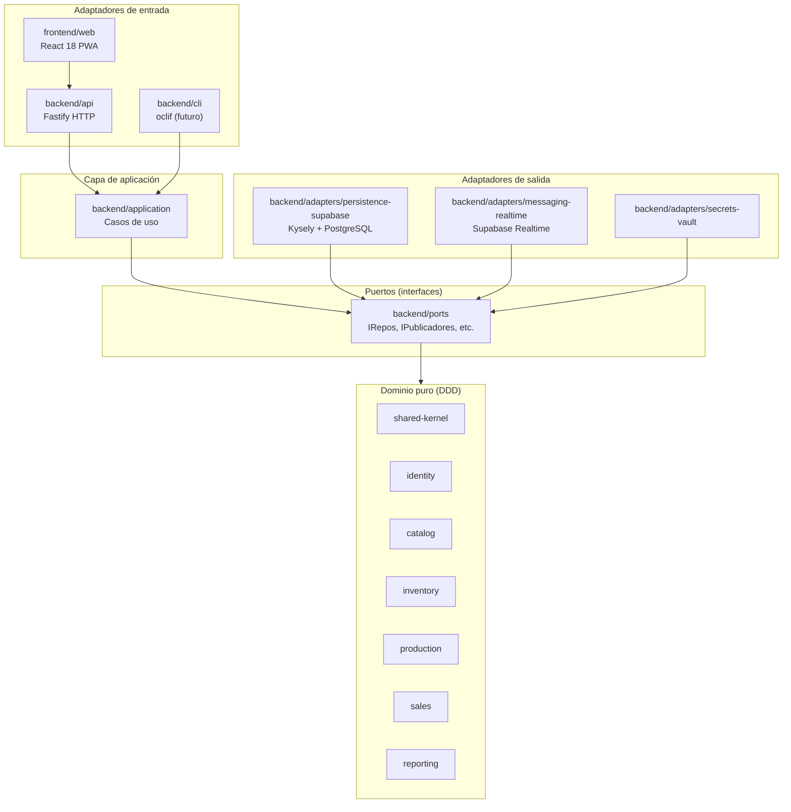

# Zahavi POS

Sistema de punto de venta para panadería-cafetería en Colombia. Arquitectura hexagonal + DDD + multi-tenant. Dos puntos de venta físicos y una planta central de producción.

**En producción:** API en Render · Frontend en Vercel · DB en Supabase cloud

---

## Inicio rápido (local con Docker)

```sh
# 1. Clonar y configurar variables de entorno
cp .env.example .env        # ajustar DATABASE_URL, JWT_SECRET

# 2. Levantar base de datos + API + frontend
docker compose up --build

# 3. Primera vez: aplicar seeds de datos de prueba
pnpm db:seed
```

La app queda disponible en `http://localhost:5173`.

**Requisitos:** Node.js 20+, pnpm 9+, Docker Desktop.

### Usuarios de prueba

| Email | Contraseña | Rol |
|---|---|---|
| julian@zahavi.local | Ver `.env` | SUPERADMIN |
| admin@zahavi.local | `Zahavi2026!` | ADMIN |
| worker@zahavi.local | PIN en tablet | WORKER |

---

## Arquitectura



**Dirección de dependencias:** `apps → adapters → application → ports → domain`. Nunca al revés. El dominio no importa nada externo.

---

## Bounded Contexts

| BC | Dominio | Estado | Endpoints |
|---|---|---|---|
| Identity | Usuarios, sesiones, TOTP, dispositivos autorizados | Completo | 9 |
| Catalog | Productos, variantes, recetas, combos, categorías | Completo | 10 |
| Inventory | Ingredientes, stock, movimientos, proveedores, alertas | Completo | 9 |
| Production | Órdenes de producción, lotes, despachos, BOM | Completo | 9 |
| Sales | Mesas, comandas, facturas, cobros, cierre de caja | Completo | 10 |
| Reporting | Dashboard, resumen de ventas, alertas de stock | Completo | 6 |

**Total:** 47 endpoints HTTP · 356+ tests verdes · E2E Playwright en `qa/e2e/`

---

## Estructura del repositorio

```
zahavi/
├── CLAUDE.md               ← Cerebro del proyecto (arquitectura, estado, workflow)
├── docker-compose.yml      ← Entorno de desarrollo local
├── render.yaml             ← Despliegue Render (API)
│
├── backend/
│   ├── api/                ← Fastify HTTP (puerto 3000)
│   ├── cli/                ← CLI admin (oclif)
│   ├── domain/             ← Núcleo DDD puro
│   │   ├── shared-kernel/  ← Money, FechaHora, DomainEvent
│   │   ├── identity/
│   │   ├── catalog/
│   │   ├── inventory/
│   │   ├── production/
│   │   ├── sales/
│   │   └── reporting/
│   ├── application/        ← Casos de uso (47 endpoints)
│   ├── ports/              ← Interfaces de repositorios y servicios
│   ├── adapters/
│   │   ├── persistence-supabase/   ← Kysely + PostgreSQL
│   │   └── messaging-realtime/     ← Supabase Realtime
│   └── shared/             ← Logger Pino, errors transversales
│
├── frontend/
│   └── web/                ← React 18 + Vite + Tailwind (PWA)
│
├── database/
│   ├── migrations/legacy/  ← SQL para Docker init
│   └── seeds/              ← Data de desarrollo
│
├── qa/
│   └── e2e/                ← Tests Playwright (requieren Docker)
│
├── supabase/
│   └── migrations/         ← Migraciones aplicadas en Supabase cloud
│
└── info/
    ├── adr/                ← Architecture Decision Records
    ├── domain-model/       ← Glosarios y aggregates por BC
    └── runbooks/           ← Procedimientos operativos
```

---

## Despliegue en producción

| Servicio | URL actual | Config |
|---|---|---|
| API | `https://zahavi-api.onrender.com` | `render.yaml` |
| Frontend | `https://zahavi-web.vercel.app` | `frontend/web/vercel.json` |
| Base de datos | Supabase (us-east-1) | `supabase/migrations/` |

### Variables de entorno (Render)

| Variable | Origen |
|---|---|
| `DATABASE_URL` | Supabase > Settings > Database > **Session mode** (puerto 5432) |
| `JWT_SECRET` | Generado automáticamente por Render |
| `CORS_ORIGIN` | URL de Vercel sin barra final |
| `LOG_LEVEL` | `info` en producción |

### Variables de entorno (Vercel)

| Variable | Valor |
|---|---|
| `VITE_API_URL` | URL de Render sin barra final |

Runbook completo: [info/runbooks/deploy-pilot.md](info/runbooks/deploy-pilot.md).

---

## Comandos del monorepo

```sh
pnpm install          # instalar dependencias
pnpm build            # compilar todos los paquetes
pnpm typecheck        # verificar tipos (20 paquetes)
pnpm lint             # ESLint flat config
pnpm test             # Vitest (unit + integration)
pnpm format           # Prettier

# Base de datos
pnpm db:migrate       # aplicar migraciones a Supabase cloud
pnpm db:seed          # semillas de desarrollo

# E2E (requiere Docker)
docker compose up -d
pnpm --filter @zahavi/api test:e2e
```

---

## Contribuir

1. Leer [CLAUDE.md](CLAUDE.md) — constitución del proyecto, obligatoria.
2. Ejecutar `/pre-commit` antes de commitear (typecheck + lint + tests + subagentes).
3. Seguir Conventional Commits: `feat(bc): ...`, `fix(bc): ...`, `docs(...): ...`.
4. Abrir PR contra `main`; CI debe estar verde (typecheck + lint + tests + gitleaks).

**Para nuevo bounded context:** usar `/new-bounded-context <nombre>` (invoca `domain-modeler`).

---

## Documentación

- [CLAUDE.md](CLAUDE.md) — arquitectura, estado del proyecto, workflow, subagentes
- [info/adr/](info/adr/) — decisiones arquitectónicas ([INDEX](info/adr/INDEX.md))
- [info/domain-model/](info/domain-model/) — aggregates, invariantes, glosarios
- [info/runbooks/](info/runbooks/) — procedimientos operativos

---

## Stack técnico

TypeScript 5 strict · Fastify · Zod · PostgreSQL 15 (Supabase) · Kysely · React 18 · Vite · Tailwind CSS · TanStack Query · Zustand · Vitest · Playwright · pnpm Turborepo · Render · Vercel
