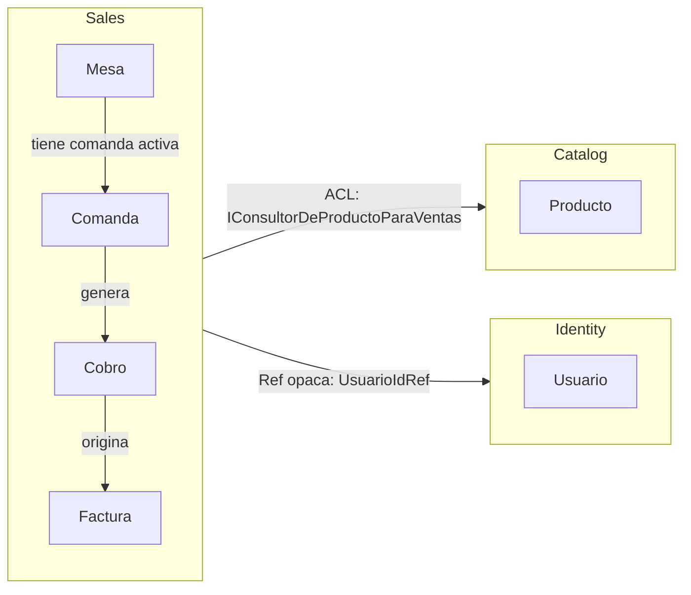
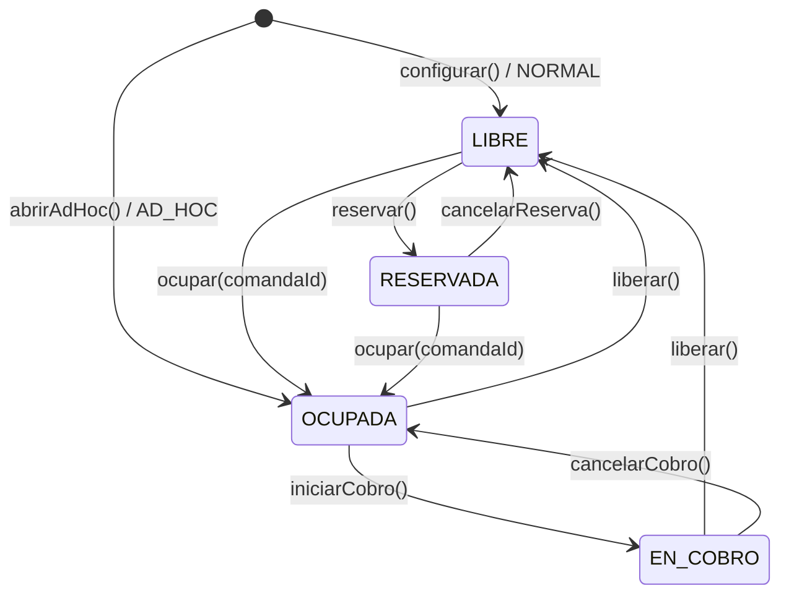
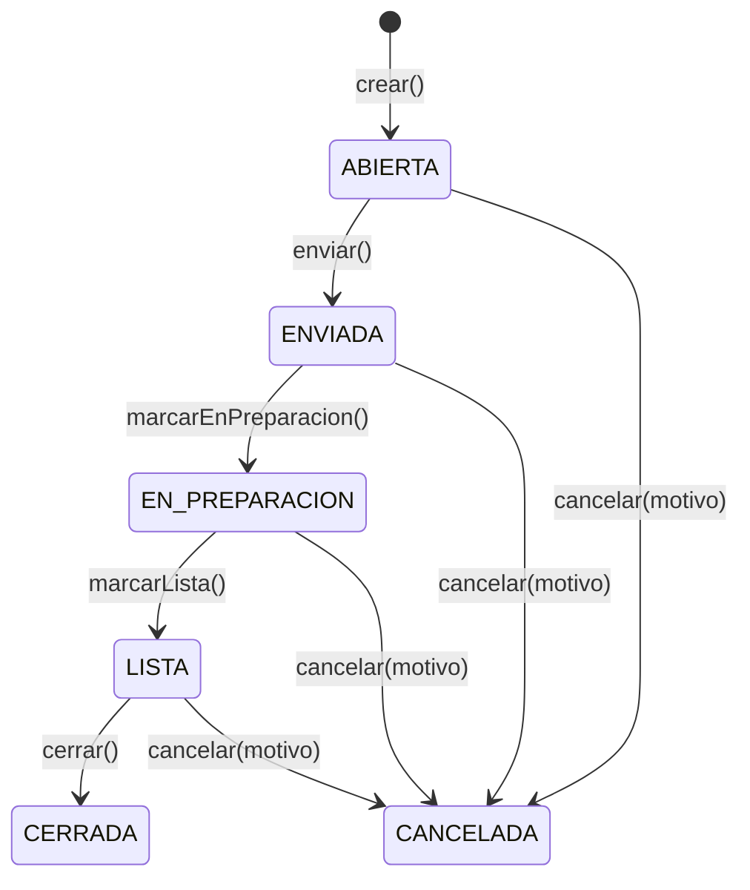
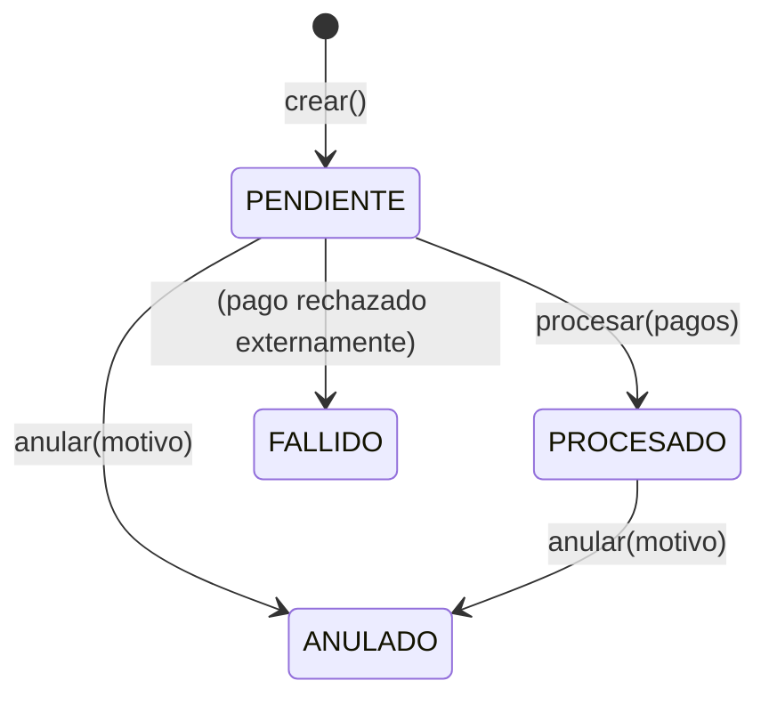
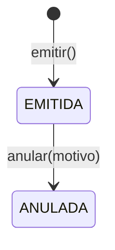

# Aggregates — Bounded Context Sales (Ventas)

## Mapa de contexto



---

## Aggregate `Mesa`

**Aggregate root.** Representa una mesa del punto de venta.

### Estados y transiciones



### Propiedades

| Propiedad | Tipo | Descripción |
|---|---|---|
| `id` | `MesaId` | Identificador único |
| `nombre` | `NombreMesa` | Ej: "Mesa 1", "Terraza 3", "Mostrador" |
| `tipo` | `TipoDeMesa` | NORMAL (catálogo) o AD_HOC |
| `puntoDeVentaId` | `BusinessUnitIdRef` | Multi-tenant |
| `estado` | `EstadoDeMesa` | Ver diagrama |
| `comandaActivaId` | `ComandaId?` | Solo presente cuando OCUPADA o EN_COBRO |

### Invariantes

1. `OCUPADA` implica `comandaActivaId != null`.
2. `LIBRE` implica `comandaActivaId == null`.
3. Solo puede haber **una comanda activa por mesa**.
4. No se puede `ocupar()` una mesa ya OCUPADA (`MesaYaOcupadaError`).

---

## Aggregate `Comanda`

**Aggregate root.** Pedido de un grupo de clientes. Contiene `LineaDeComanda` como entidades.

### Estados y transiciones



### Propiedades principales

| Propiedad | Tipo | Descripción |
|---|---|---|
| `id` | `ComandaId` | Identificador único |
| `mesaId` | `MesaId` | Mesa donde se generó |
| `puntoDeVentaId` | `BusinessUnitIdRef` | Multi-tenant |
| `lineas` | `LineaDeComanda[]` | Ítems del pedido |
| `estado` | `EstadoDeComanda` | Ver diagrama |
| `tomadaPor` | `UsuarioIdRef` | Mesero que creó la comanda |
| `totalConIVA` | `Dinero` | Calculado: suma de `subtotalConIVA` de líneas activas |

### Invariantes

1. Solo se pueden agregar/cancelar líneas en estado `ABIERTA`.
2. Para `enviar()`, debe haber al menos una línea activa (`ComandaSinLineasError`).
3. `cantidad` por línea debe ser un entero >= 1.
4. `CERRADA` y `CANCELADA` son terminales.
5. `cancelar()` requiere motivo no vacío.

### Entidad `LineaDeComanda`

Parte del aggregate `Comanda`. No persiste independientemente.

| Propiedad | Tipo | Descripción |
|---|---|---|
| `id` | `LineaDeComandaId` | Identificador estable |
| `varianteId` | `ProductVariantIdRef` | Ref al producto (ACL) |
| `nombreProducto` | `string` | Snapshot del nombre en el momento de venta |
| `cantidad` | `number` | Entero >= 1 |
| `precioUnitario` | `Dinero` | Snapshot del precio |
| `tasaIVA` | `TasaIVA` | 0 o 0.19 — snapshot del IVA |
| `subtotalConIVA` | `Dinero` | Calculado: `precioUnitario × cantidad × (1 + tasaIVA)` |

---

## Aggregate `Cobro`

**Aggregate root.** Registro del pago de una comanda. Soporta múltiples métodos de pago.

### Estados y transiciones



### Propiedades principales

| Propiedad | Tipo | Descripción |
|---|---|---|
| `id` | `CobroId` | Identificador único |
| `comandaId` | `ComandaId` | Comanda que se está cobrando |
| `totalComanda` | `Dinero` | Snapshot del total al momento del cobro |
| `pagos` | `PagoDetalle[]` | Lista de pagos individuales |
| `totalCobrado` | `Dinero` | Suma de todos los pagos |
| `cambio` | `Dinero` | `max(0, totalCobrado - totalComanda)` |

### Invariantes

1. Para `procesar()`, `totalCobrado >= totalComanda` (`CobrosIncompletosError`).
2. Para `procesar()`, `pagos.length >= 1` (`PagosVaciosError`).
3. Un cobro `PROCESADO` no puede procesarse de nuevo.
4. Un cobro `ANULADO` o `FALLIDO` no puede anularse.

### Value Object `PagoDetalle`

| Propiedad | Tipo |
|---|---|
| `metodo` | `MetodoDePago` (EFECTIVO / TARJETA / TRANSFERENCIA / NEQUI / DATAFONO) |
| `monto` | `Dinero` |

---

## Aggregate `Factura`

**Aggregate root.** Documento de cobro interno (recibo). Snapshot inmutable de la comanda.

> La integración con DIAN (factura electrónica) queda para la **Iteración 7 — Refinamiento**.

### Estados



### Propiedades principales

| Propiedad | Tipo | Descripción |
|---|---|---|
| `id` | `FacturaId` | Identificador único |
| `numero` | `NumeroFactura` | Ej: "FAC-2026-00001" (secuencia gestionada por adapter) |
| `cobroId` | `CobroId` | Cobro que originó la factura |
| `lineas` | `FacturaLinea[]` | Snapshot de las líneas de la comanda |
| `subtotal` | `Dinero` | Suma sin IVA |
| `totalIVA` | `Dinero` | Suma del IVA |
| `total` | `Dinero` | `subtotal + totalIVA` |

### Invariantes

1. Solo puede emitirse desde un cobro PROCESADO (garantizado por el caso de uso, no el aggregate).
2. Una factura ANULADA no puede anularse de nuevo.
3. `anular()` requiere motivo no vacío.
4. Los totales son inmutables desde la emisión.

---

## ACL hacia Catalog

**Puerto:** `IConsultorDeProductoParaVentas` (en `@zahavi/ports`)

```typescript
interface DatosDeVentaDeProducto {
  varianteId: string;
  nombre: string;
  precioUnitario: number; // COP entero
  tasaIVA: number;        // 0 ó 0.19
}

interface IConsultorDeProductoParaVentas {
  obtenerDatosDeVenta(varianteId: string): Promise<DatosDeVentaDeProducto | null>;
}
```

El caso de uso `AgregarLineaAComanda` invoca el ACL antes de llamar a
`comanda.agregarLinea()`. El aggregate nunca ve ni importa el aggregate `Producto` de Catalog.

---

## Decisión arquitectónica nueva (ADR sugerido)

**ADR-0004 propuesto:** ACL `IConsultorDeProductoParaVentas` — Sales necesita precio y tasa IVA
del Catalog BC en el momento de agregar líneas. Se decide ACL via puerto en lugar de un
Shared Kernel para evitar acoplamiento entre aggregates de distintos BC. Ver
[ADR-0002](../../adr/ADR-0002-acl-cross-bc-escandallo.md) como precedente.
